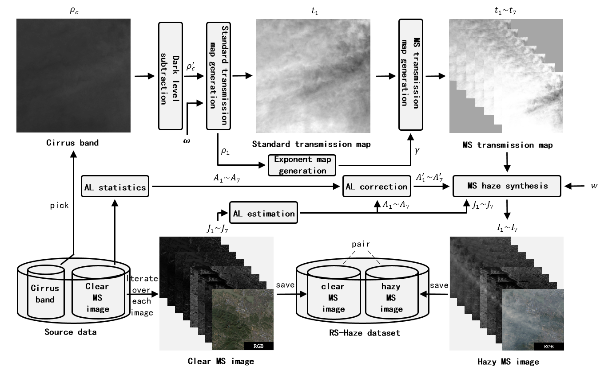

# RS-Haze
This is the basic code for synthesizing haze on clear MS image in RS-Haze dataset.

You can construct a new dataset based on this code, your own dataset design and data. It depends on your need.

## Flow chart


## Note 
- `./data`: source data.
  - `/cirrus`: haze pattern (cirrus band in real MS hazy images) 
  - `/00215`: clear MS image (test sample) 
- `./result`: synthesized hazy images and transmission map.
- run `python synthesis.py` (make sure you have installed all dependcies).

## Citation

If you find this work useful for your research, please cite our paper:

```bibtex
@article{song2023vision,
  title={Vision Transformers for Single Image Dehazing},
  author={Song, Yuda and He, Zhuqing and Qian, Hui and Du, Xin},
  journal={IEEE Transactions on Image Processing},
  year={2023},
  volume={32},
  pages={1927-1941}
}
```

## Others
If you have any problem, please create an issue. 
I will check and handle issue list at weekends. 

You can find more details at https://github.com/IDKiro/DehazeFormer. 

If you find this code helps, you are **free to use this code without copyright restrictions**.